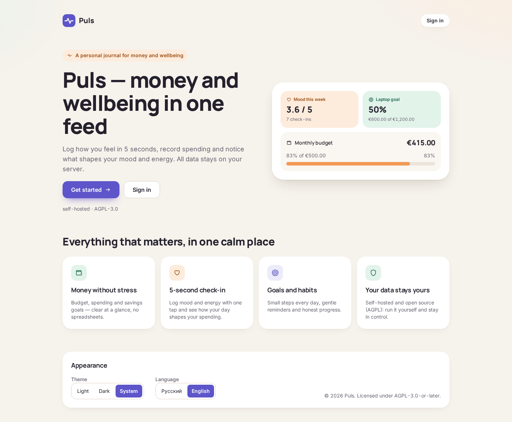
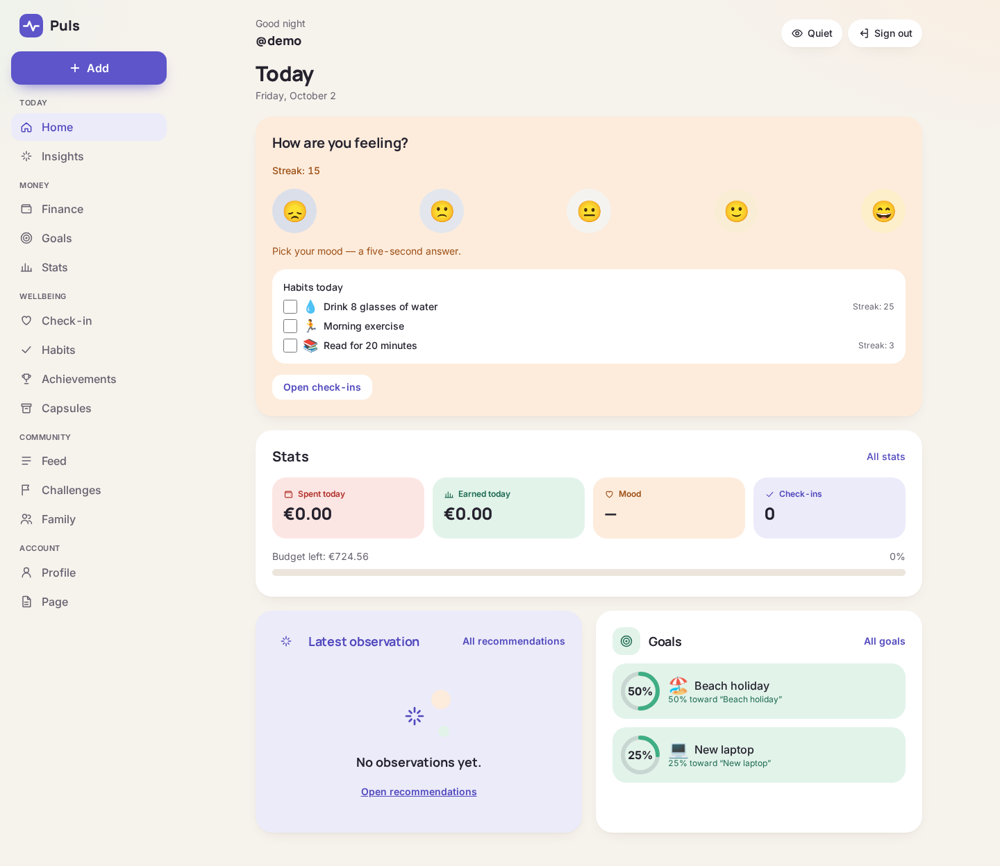
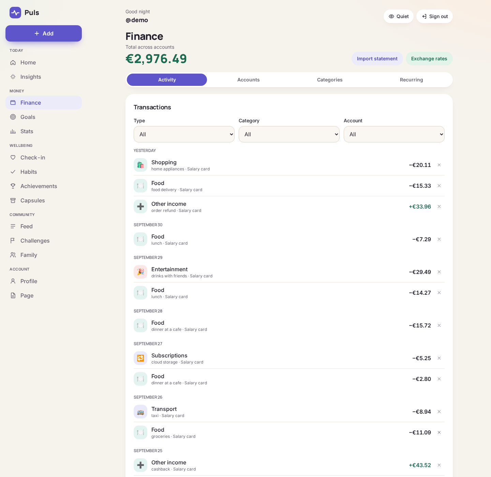
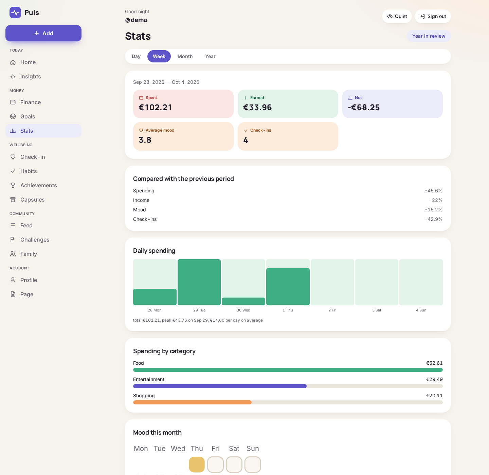
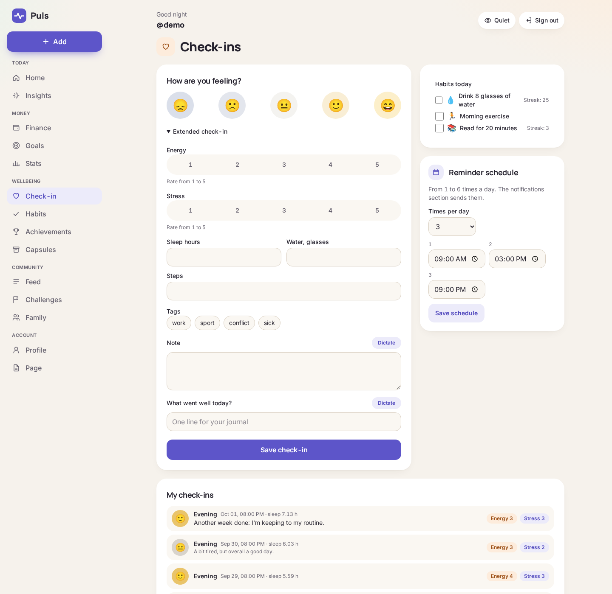
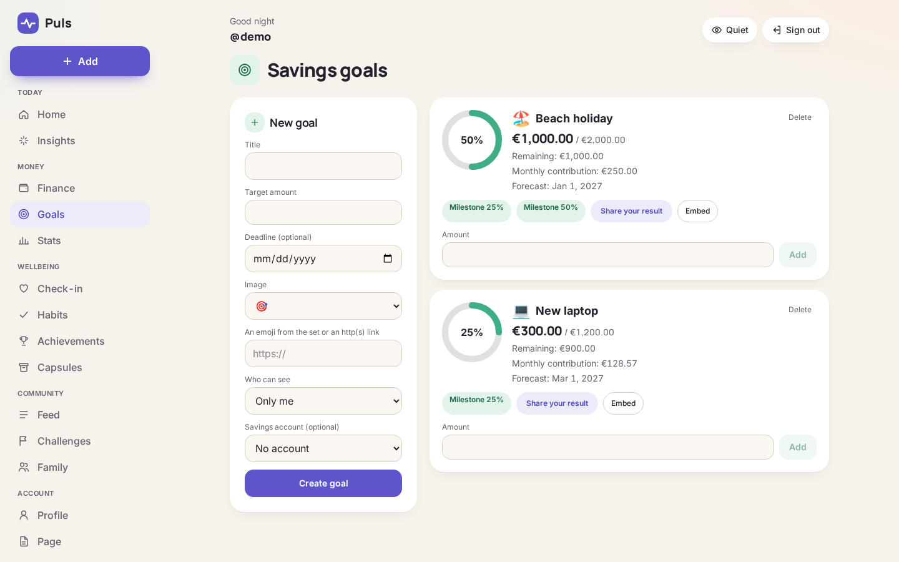
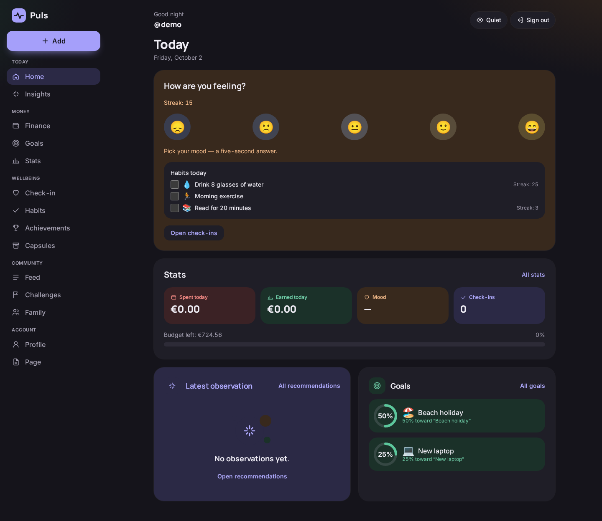
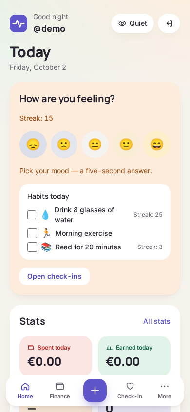
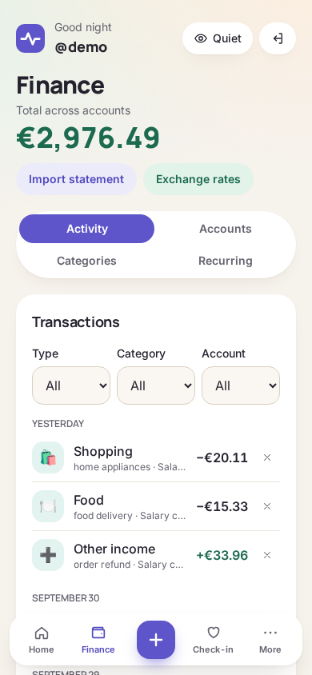

<div align="center">

# Puls

[Русский](README.md) · **English**

**A self-hosted tracker for personal finance, wellbeing and achievements.**  
Money, mood, habits and goals in one calm feed. Your data stays on your server.

[](LICENSE)
[](https://github.com/g99see/pulse-selfhosted/actions/workflows/ci.yml)




</div>

## Screenshots

|                                 Today                                 |                               Finance                               |
| :-------------------------------------------------------------------: | :-----------------------------------------------------------------: |
|             |              |
|                                 Stats                                 |                              Check-in                               |
|                 |              |
|                                 Goals                                 |                              Dark theme                             |
|                 |       |

<p align="center">
  
  
</p>

## Features

**Finance**

- Accounts, transactions, budgets, custom categories, quick entry like "lunch 12.50"
- Recurring payments, multiple currencies with exchange rates, CSV bank statement import
- Daily, weekly and monthly stats, plus a "Year in review"

**Wellbeing and habits**

- 5-second mood check-in; the extended one adds energy, stress, sleep, a journal line and tags
- Voice check-in: audio never leaves the browser, only the text is sent to the server
- Daily and weekly habits, streaks, achievements
- Correlations between spending and mood, rule-based insights, a weekly review

**Goals and achievements**

- Savings goals with a forecast, milestones and contribution reminders
- Achievements and streaks, challenges with friends, a time capsule
- An embeddable public goal widget (iframe)

**Community**

- Public profile `/@nickname`, a feed, follows, reactions, comments
- Your own HTML page in the profile, served from an isolated sandbox on a separate origin
- Family mode: shared accounts and goals, while everyone keeps a private journal
- Moderation and roles

**AI assistant with your own key**

- Ask about your own data in plain language
- Anthropic, OpenAI, OpenRouter, OpenCode Go/Zen, Google Gemini, DeepSeek, Mistral, Groq, xAI or a local model via Ollama; the key is yours and is stored encrypted

**Privacy and security**

- Self-hosted, open source (AGPL), no mandatory cloud services
- Cookie sessions, CSRF protection, Argon2, 2FA (TOTP), sign-in with Google and Telegram
- Secrets are encrypted with AES-256-GCM; "Quiet" mode hides all amounts (Alt+Q)
- Telegram bot, web push and email notifications, PWA, open API and webhooks (Home Assistant, n8n)

The interface is available in English and Russian, with 15 base currencies (EUR, USD, GBP, RUB, UAH, KZT and more).
More details in the [documentation](docs-site/index.md) (currently in Russian).

## One-command install

Supported: Debian 12/13 and Ubuntu 22.04/24.04 (also works in a Proxmox LXC with `nesting=1,keyctl=1`).

```bash
curl -fsSL https://raw.githubusercontent.com/g99see/pulse-selfhosted/master/scripts/install.sh | sudo bash
```

The installer:

- installs Docker if it is missing;
- clones the project to `/opt/puls`;
- generates secrets in `/opt/puls/.env` (mode 600);
- builds and starts the services;
- creates the first administrator and saves the credentials to `/root/puls-credentials.txt` (mode 600).

With options (download `install.sh` and run it locally, or pass them after `bash -s --`):

```bash
# Public server: HTTPS via Let's Encrypt
sudo bash install.sh --domain example.com --sandbox-domain usercontent.example.com --email admin@example.com

# Home network: plain HTTP, sandbox on port 8080
sudo bash install.sh --http --host 192.168.1.50
```

Other options: `--admin-email`, `--admin-nickname`, `--smtp-url`, `--registration open|invite|closed`,
`--dir`, `--dry-run`, `-y`. See `install.sh --help`. Without SMTP, registration is set to invite-only, because
new users would not be able to confirm their email.

**Profiles:** without SMTP people can't sign up themselves, so the admin creates them:
`sudo /opt/puls/scripts/users.sh add mom@example.com mom --locale en` (the password is shown once).
Reset a password: `users.sh password <email>`; all commands: `users.sh help`.
A step-by-step beginner guide (in Russian): [`docs-site/guide/quick-start.md`](docs-site/guide/quick-start.md).

**Update:** `sudo /opt/puls/scripts/upgrade.sh` (backup → `git pull` → build → start).  
**Backup and restore:** `scripts/backup.sh` and `scripts/restore.sh`; a daily backup runs automatically.  
**Manual install** with Docker Compose: [`docs-site/guide/installation.md`](docs-site/guide/installation.md),
all variables: [`docs-site/guide/configuration.md`](docs-site/guide/configuration.md).

## Stack

| Layer          | Technologies                                            |
| -------------- | ------------------------------------------------------- |
| Monorepo       | pnpm workspaces, TypeScript 5.9                         |
| Frontend       | Next.js 15 (App Router, standalone), React 19, Tailwind |
| Backend        | NestJS, Prisma 6, PostgreSQL 16                         |
| Cache & queues | Valkey 8, BullMQ                                        |
| Shared schemas | `@puls/shared` (Zod)                                    |
| Tests          | Vitest (unit + integration), Playwright (e2e)           |
| Delivery       | Docker Compose, Caddy (automatic HTTPS), GitHub Actions |

## Development

Requirements: Node.js ≥ 20, pnpm 11, Docker with Compose.

```bash
pnpm install
cp .env.example .env          # fill in the passwords
pnpm docker:dev:up            # postgres:16 + valkey:8 with ports on the host
pnpm db:migrate               # prisma migrate dev
pnpm build && pnpm test       # build all packages and run unit tests
pnpm dev                      # api and web in watch mode
```

In dev: API at `http://localhost:3001/health`, web at `http://localhost:3000`.

Checks:

```bash
pnpm lint            # ESLint
pnpm typecheck       # tsc --noEmit
pnpm test            # Vitest
pnpm e2e             # Playwright
pnpm format:check    # Prettier
pnpm license:check   # dependency license compatibility
pnpm --filter @puls/docs dev     # documentation (VitePress) locally
```

Demo data (user `demo`, ~90 days of transactions and check-ins, goals, habits):

```bash
scripts/dev-run.sh start                                # api and web without Docker
node scripts/demo/seed.mjs --locale en --currency EUR   # needs DATABASE_URL (env, .env or ~/.config/puls/env)
```

## Structure

```
apps/
  api/        NestJS + Prisma, migrations
  web/        Next.js 15, Tailwind, Playwright
packages/
  shared/     Zod schemas, mood scale, money formatting
docker-compose.yml       postgres, valkey, api, web, caddy, backup
docker-compose.dev.yml   dev override: postgres and valkey ports on the host
Caddyfile                routing + sandbox for user HTML (HTTPS)
Caddyfile.http           the same for plain HTTP on a LAN
docs-site/               documentation (VitePress)
docs/                    plan, phase notes, "soft wellbeing" redesign
scripts/                 install, upgrade, backup, restore, demo
deploy/systemd/          user systemd units
```

## Contributing

Bugs and ideas go to [Issues](https://github.com/g99see/pulse-selfhosted/issues), code via pull requests.
Guidelines: [`CONTRIBUTING.md`](CONTRIBUTING.md), [`CODE_OF_CONDUCT.md`](CODE_OF_CONDUCT.md).
Please report vulnerabilities privately, see [`SECURITY.md`](SECURITY.md).

## License

**AGPL-3.0-or-later**, see [`LICENSE`](LICENSE). If you run a modified version as a public service, you must
publish your changes. User content (HTML pages, texts) is not covered by the code license.
