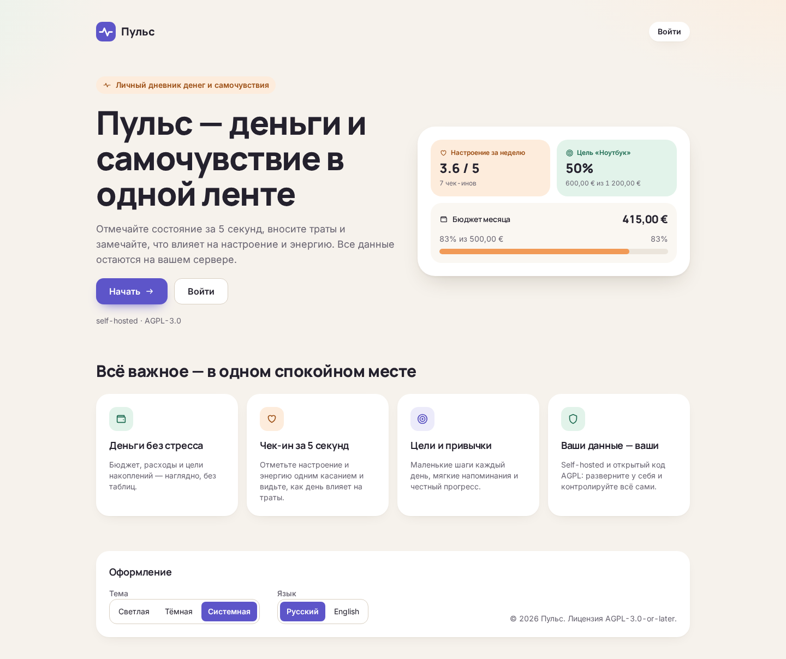
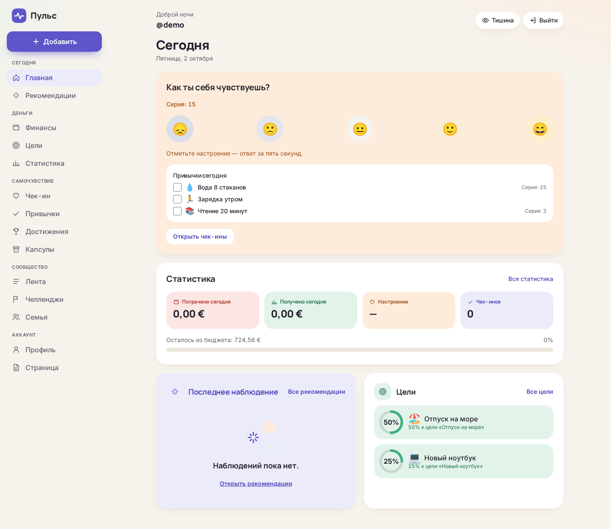
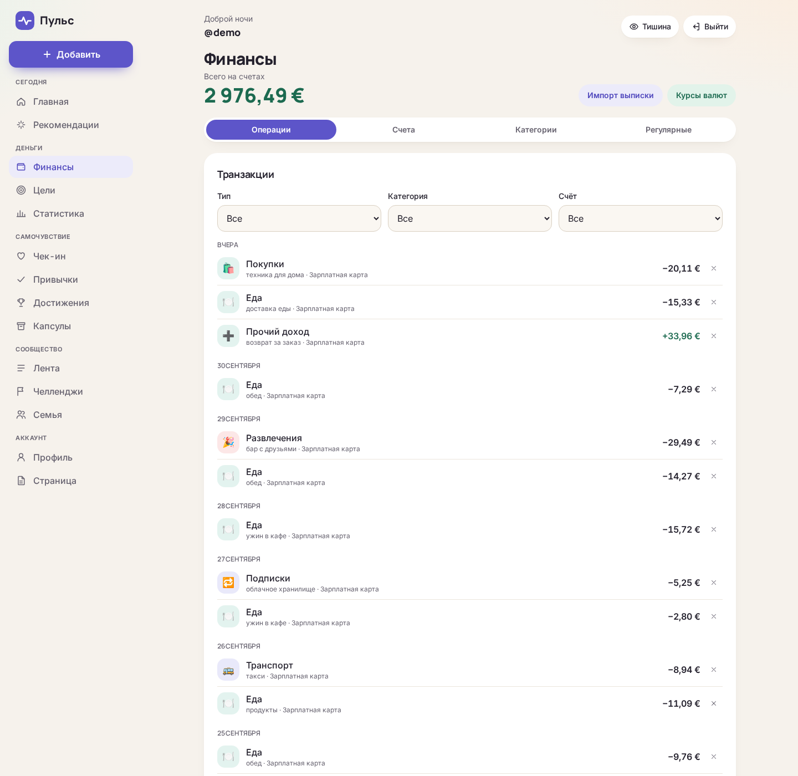
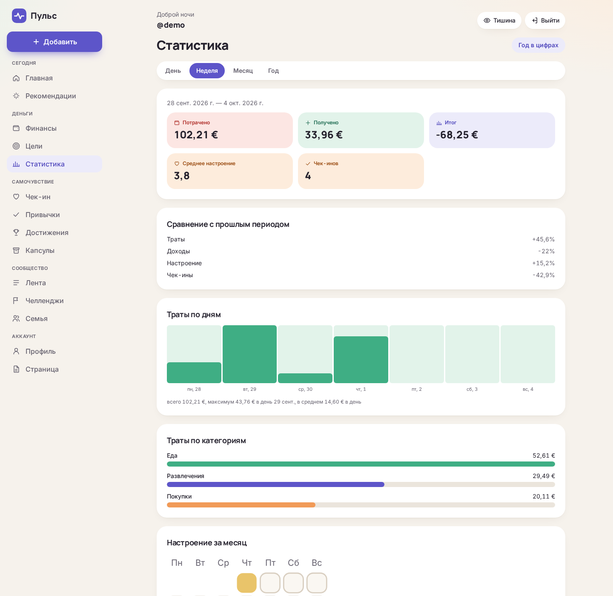
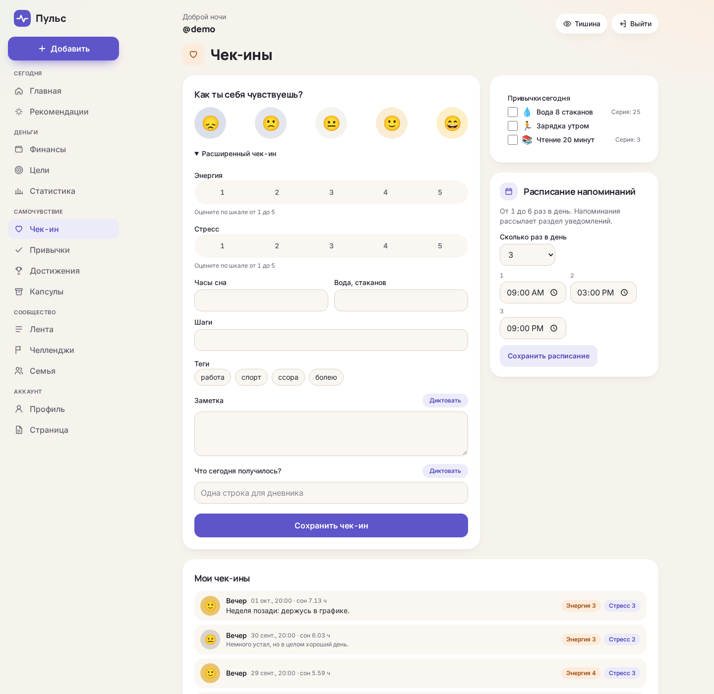
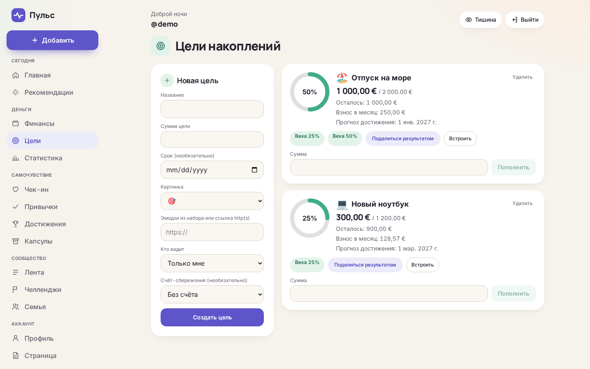
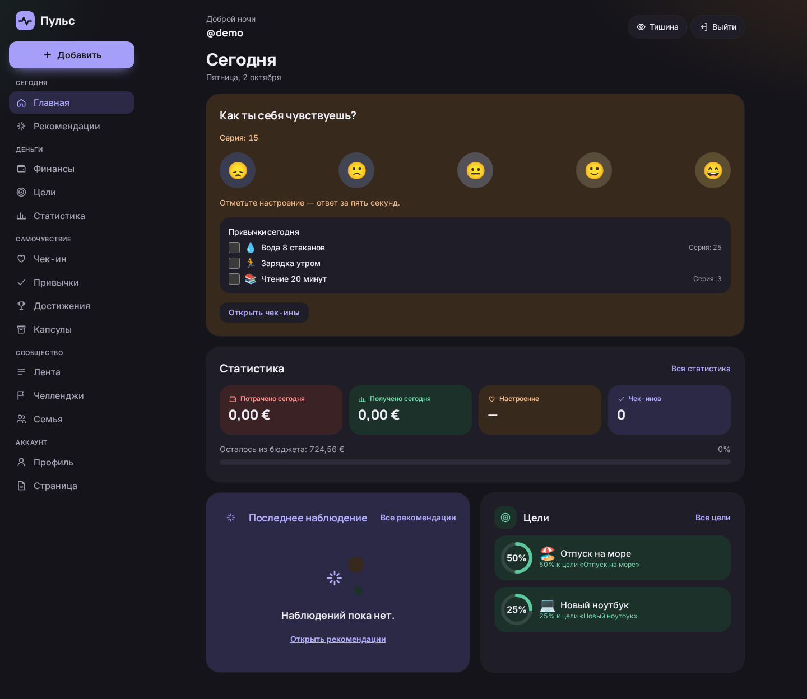
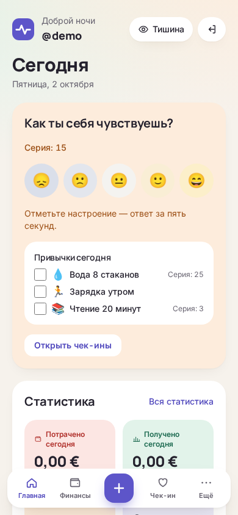
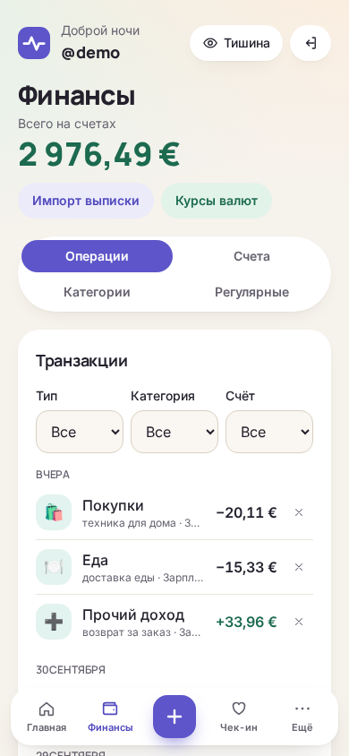

<div align="center">

# Пульс

**Русский** · [English](README.en.md)

**Self-hosted трекер личных финансов, самочувствия и достижений.**  
Деньги, настроение, привычки и цели — в одной спокойной ленте. Ваши данные остаются на вашем сервере.

[](LICENSE)
[](https://github.com/g99see/pulse-selfhosted/actions/workflows/ci.yml)




</div>

## Скриншоты

|                                  Сегодня                                  |                              Финансы                               |
| :-----------------------------------------------------------------------: | :----------------------------------------------------------------: |
|                            |                         |
|                                Статистика                                 |                              Чек-ин                                |
|                              |                         |
|                                   Цели                                    |                            Тёмная тема                             |
|                              |                  |

<p align="center">
  
  
</p>

## Возможности

**Финансы**

- Счета, транзакции, бюджеты, свои категории, быстрый ввод «обед 450»
- Регулярные платежи, мультивалютность с курсами, импорт выписок CSV
- Статистика по дням, неделям и месяцам, «Год в цифрах»

**Самочувствие и привычки**

- Чек-ин настроения за 5 секунд; расширенный — энергия, стресс, сон, дневник, теги
- Голосовой чек-ин: аудио не покидает браузер, на сервер идёт только текст
- Ежедневные и еженедельные привычки, серии, достижения
- Корреляции между тратами и настроением, правила-инсайты, еженедельный разбор

**Цели и достижения**

- Цели накоплений с прогнозом, вехами и напоминаниями о взносах
- Достижения и серии, челленджи с друзьями, капсула времени
- Виджет публичной цели для встраивания через iframe

**Сообщество**

- Публичный профиль `/@nickname`, лента, подписки, реакции, комментарии
- Своя HTML-страница в профиле — в изолированной песочнице на отдельном домене
- Семейный режим: общие счета и цели, у каждого — приватный дневник
- Модерация и роли

**AI-помощник по своему ключу**

- Вопросы о своих данных обычным языком
- Anthropic, OpenAI, OpenRouter или локальная модель через Ollama — ключ ваш, он хранится зашифрованным

**Приватность и безопасность**

- Self-hosted, открытый код AGPL, без обязательных облачных сервисов
- Cookie-сессии, CSRF, Argon2, 2FA (TOTP), вход через Google и Telegram
- Секреты шифруются AES-256-GCM; режим «Тишина» скрывает суммы (Alt+Q)
- Telegram-бот, web push и email-уведомления, PWA, открытый API и вебхуки (Home Assistant, n8n)

Подробный список — в [документации](docs-site/index.md).

## Установка одной командой

Поддерживаются Debian 12/13 и Ubuntu 22.04/24.04 (работает и в Proxmox LXC с `nesting=1,keyctl=1`).

```bash
curl -fsSL https://raw.githubusercontent.com/g99see/pulse-selfhosted/master/scripts/install.sh | sudo bash
```

Установщик:

- ставит Docker, если его нет;
- клонирует проект в `/opt/puls`;
- генерирует секреты в `/opt/puls/.env` (права 600);
- собирает и запускает сервисы;
- создаёт первого администратора и сохраняет доступы в `/root/puls-credentials.txt` (права 600).

С параметрами (скачайте `install.sh` и запустите локально):

```bash
# Публичный сервер: HTTPS через Let's Encrypt
sudo bash install.sh --domain example.com --sandbox-domain usercontent.example.com --email admin@example.com

# Домашняя сеть: обычный HTTP, песочница на порту 8080
sudo bash install.sh --http --host 192.168.1.50
```

**Обновление:** `sudo /opt/puls/scripts/upgrade.sh` (бэкап → сборка → запуск).  
**Бэкап и восстановление:** `scripts/backup.sh` и `scripts/restore.sh`, подробности — в [`docs/PHASE1-OPS.md`](docs/PHASE1-OPS.md).  
**Ручная установка** через Docker Compose — [`docs-site/guide/installation.md`](docs-site/guide/installation.md), все переменные — [`docs-site/guide/configuration.md`](docs-site/guide/configuration.md).

## Стек

| Слой          | Технологии                                              |
| ------------- | ------------------------------------------------------- |
| Монорепо      | pnpm workspaces, TypeScript 5.9                         |
| Фронтенд      | Next.js 15 (App Router, standalone), React 19, Tailwind |
| Бэкенд        | NestJS 12, Prisma 6, PostgreSQL 16                      |
| Кеш и очереди | Valkey 8, BullMQ                                        |
| Общие схемы   | `@puls/shared` (Zod)                                    |
| Тесты         | Vitest (unit + smoke), Playwright (e2e)                 |
| Поставка      | Docker Compose, Caddy (авто-HTTPS), GitHub Actions      |

## Разработка

Требования: Node.js ≥ 20, pnpm 11, Docker с Compose.

```bash
pnpm install
cp .env.example .env          # заполните пароли
pnpm docker:dev:up            # postgres:16 + valkey:8 с портами на хост
pnpm db:migrate               # prisma migrate dev
pnpm build && pnpm test       # сборка всех пакетов и unit-тесты
pnpm dev                      # api и web в watch-режиме
```

В dev: API `http://localhost:3001/health`, web `http://localhost:3000`.

Проверки:

```bash
pnpm lint            # ESLint
pnpm typecheck       # tsc --noEmit
pnpm test            # Vitest: unit-тесты (без БД)
pnpm test:smoke      # Vitest: smoke API против живого PostgreSQL
pnpm e2e             # Playwright
pnpm format:check    # Prettier
pnpm license:check   # совместимость лицензий зависимостей
pnpm --filter @puls/docs dev     # документация (VitePress) локально
```

Демо-данные (пользователь `demo`, ~90 дней транзакций и чек-инов, цели, привычки):

```bash
scripts/dev-run.sh start        # api и web без Docker
node scripts/demo/seed.mjs      # нужен DATABASE_URL (в окружении, .env или ~/.config/puls/env)
node scripts/demo/seed.mjs --locale en --currency EUR   # демо на английском и в евро
```

Сценарий демонстрации на 10 минут — [`docs/PRESENTATION.md`](docs/PRESENTATION.md). Автозапуск без Docker через systemd — [`deploy/systemd/`](deploy/systemd/).

## Структура

```
apps/
  api/        NestJS + Prisma, миграции
  web/        Next.js 15, Tailwind, Playwright
packages/
  shared/     Zod-схемы, шкала настроения, форматирование денег
docker-compose.yml       postgres, valkey, api, web, caddy, backup
docker-compose.dev.yml   dev-оверрайд: порты postgres и valkey на хост
Caddyfile                маршрутизация + песочница пользовательского HTML
docs-site/               документация (VitePress)
docs/                    план, описания фаз, редизайн «soft wellbeing»
scripts/                 install, upgrade, backup, restore, demo
deploy/systemd/          пользовательские systemd-юниты
```

## Документация

- Пользовательская и админская документация — [`docs-site/`](docs-site/index.md) (VitePress)
- План и статус — [`docs/PLAN.md`](docs/PLAN.md); фазы 1–5 реализованы, описания — `docs/PHASE*.md`
- Редизайн «soft wellbeing» — [`docs/REDESIGN.md`](docs/REDESIGN.md)

## Участие

Баги и идеи — через [Issues](https://github.com/g99see/pulse-selfhosted/issues), код — через pull request.
Правила — [`CONTRIBUTING.md`](CONTRIBUTING.md), [`CODE_OF_CONDUCT.md`](CODE_OF_CONDUCT.md).
Об уязвимостях сообщайте приватно — [`SECURITY.md`](SECURITY.md).

## Лицензия

**AGPL-3.0-or-later** — см. [`LICENSE`](LICENSE). Если вы запускаете изменённую версию как публичный сервис,
вы обязаны открыть свои изменения. Пользовательский контент (HTML-страницы, тексты) лицензией кода не покрывается.
